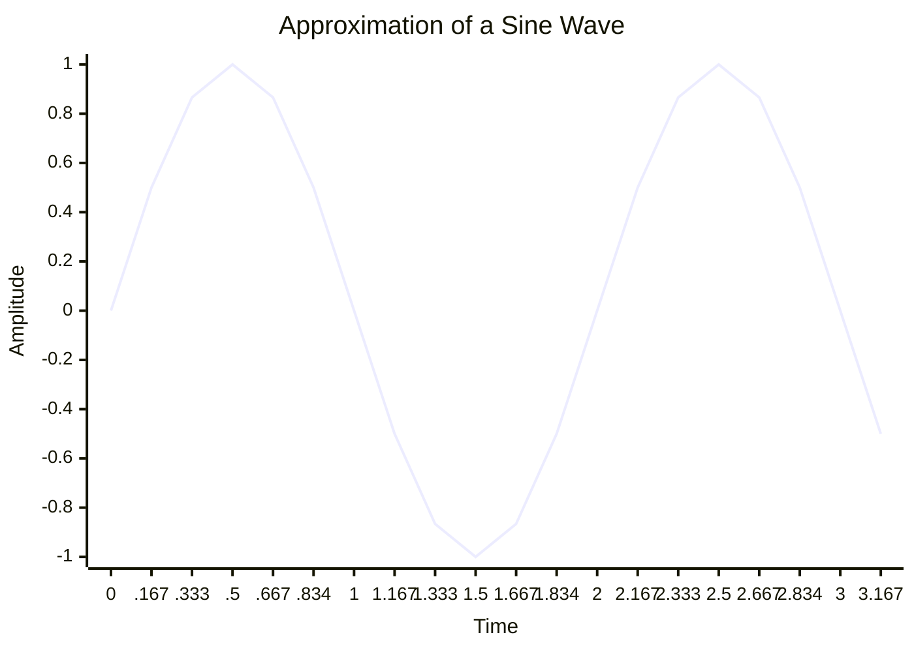

# ep13 - invulnerability

## Objectives
- 

## Challenge 1

## Challenge 2

## Challenge 3

## Notes
- using the `sin(x)` function in pico8, we can create oscillations
```lua
--_init()
...
invuln=0
...
--_update()
...
if invuln<=0 then
    --can be hit
    --collision ship x enemies
    for en_ref in all(enemies) do
        if col(en_ref,ship) then
            lives-=1
            sfx(0)
            invuln=30
        end
    end
else
    --cannot be hit
    --reduce iframe count
    invuln-=1
end
...
--_draw()
...
if invuln<=0 then
    drw_obj(ship)
else
    if sin(t/10)>0 then
        drw_obj(ship)
    end
end
drw_obj(boost)
...
```
- we start at 0 iframes, and when we're hit by an enemy, we set this to 30
- if we ever have iframes, we don't need to check collision, just remove 1 iframe from the counter
- In the draw function, if we're at 0 or less iframes we draw the ship like normal
- otherwise, **we draw the ship sometimes**, and draw nothing other times (but always draw the boost for tracking purposes)

- this **"draw ship sometimes"** is using `sin(t/n)<m` where
- `n` is what we're dividing our framecount by
    - if we purely went by the integer framecount 0,1,2,3 - the output of `sin(any integer)==0` in all cases
    - so, we divide `t/n` in order to get a decimal value, which as shown in the graph above, different decimal values will actually oscillate between between negative and positive
    - `framecount/10` for example produces `0.1,0.2,0.3,0.4, ... 1.3,1.4,1.5, ...`
    - and you can see from the graph above that these decimal X values produce values between `0 to 1` sometimes and produces values between `0 to -1` sometimes
  - `m` is the threshold that our conditional is check below
    - say `n=10,m=0`
    - if the `sin(t/10) < 0` for example, then we render ship, otherwise render nothing
    - this we're going to get a positive number output for the first ten frames, then a negative number output for the next ten frames, back and forth - and these directly correspond to showing and not showing the sprite
    - which, is our blink affect
  - What happens, if we change `m` to not be zero?
    - say `m=0.8` instead, what happens?
    - well, keeping `n=10`, the first frame gives us `sin(0.1)` again, which is less than `0.8`, so we actually aren't going to draw the ship on this first frame
    - the second frame is evaluating `sin(0.2)` and going by the graph this is STILL less than `0.8` our threshold, so we're STILL not going to draw the ship
    - finally, on the third frame of `sin(0.3)` we evaluate to something above our `0.8` threshold, and that if conditional is triggered and we draw our ship
    - this only is drawn for 3 total frames, before dipping all the way back down the sine wave curve and back up eventually
    - so, one can think of `m` *as a lever for during my blink animation, how many ship frames should i show vs how many empty frames should i show*
  - What happens, if we change `n` to not be ten?
    - let's keep `m=0` for now, meaning we should roughly have a 50/50 split on our flicker between showing and not showing the ship
    - if `sin(t/n)` is our input, what is `sin(t/5)`, as the framecount marches on?
    - instead of `t/10` which produces decimals `0.1,0.2,0.3, ...`
    - our new ratio `t/5` produces `0.5, 1.0, 1.5, 2.0, ...`
    - looking at the chart, each frame instead of us traversing the graph slowly to the right, we're rapidly skipping forward in big intervals, with only *two frames* between something like `sin(0.5)==1` and `sin(1.5)==-1`
    - what this means, is that we're oscillating between showing and not showing the ship sprite *every two frames* - **1/15th of a SECOND** between each draw state
    - to contrast, with `n=10,m=0`, we're blinking between showing and not showing *every 10 frames* - that's a **third of a second** for each draw state
  - Given all this, we summarize
    - Oscillating between two states in pico8 can be done via the following
        ```lua
        if sin(t/n) > m then state_a() else state_b() end
        ```
    - where 
      - **n** controls the *speed* of switching between `state_a()` and `state_b()`
      - **m** controls the *ratio* of time spent in `state_a()` and `state_b()`